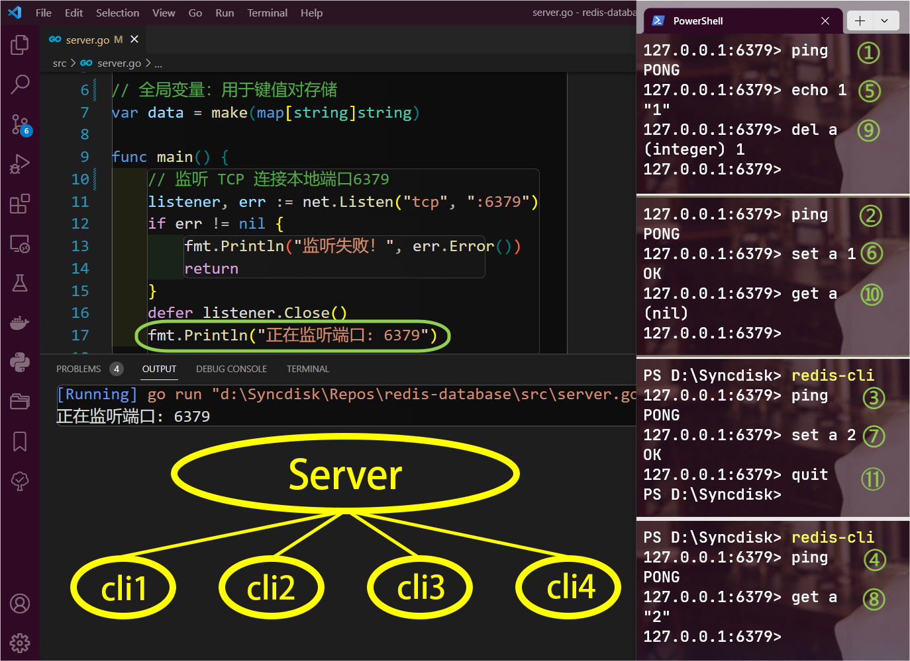

# 构建自己的 Redis

[TOC]

## 项目目标

1. 监听 TCP 连接，绑定本地6379端口
2. 使用`PONG`响应`PING`指令
3. 返回`ECHO`指令的参数
4. 实现`SET`指令保存键值对、`GET`指令获取值、`DEL`指令删除值
5. 实现`QUIT`指令断开连接
6. 处理并发连接

## 项目结构

```shell
.
├── README.md  		# 项目说明文档
├── go.mod     		# 项目依赖和版本控制
├── go.sum     		# 保存校验和文件
├── img
│   └── result.png  # 运行结果截图
└── src
    └── server.go   # Redis服务器源代码

2 directories, 5 files
```


## 整体设计

为了构建可存储数据的服务端，我定义了全局变量`data = make(map[string]string)`，用于存储用户输入的键值对。

主程序中共定义了三个函数：

- `processCommand`函数：使用`switch`语句处理客户端发来的`PING, ECHO, SET, GET, DEL, QUIT`指令，并返回处理结果。

- `handleConnection`函数：接收`net.Conn`类型的参数，表示与客户端建立连接。其中`reader`和`writer`用于从连接中读取命令并向客户端发送结果。调用另一个函数`processCommand`处理指令，获取返回的结果，并写入`writer`，最后将缓冲区的数据刷新到连接中确保结果发送给客户端。
- `main`函数：创建监听器，监听本地端口6379的 TCP 连接，并且接收客户端发来的请求。每次成功接收到客户端连接后，使用`go`关键字并发调用`handleConnection`处理连接，这样就可以同时处理多个客户端的连接请求。我使用`defer`关键字来延迟关闭监听器，确保程序退出前及时关闭监听。

至此，server程序实现了所有的项目目标，运行结果如下：

## 运行结果

```shell
❯ go run ./src  # 运行 Go 程序，打开服务端等待连接请求
❯ redis-cli     # 打开4个客户端，按下图顺序发送请求，得到响应
```

如下图，我创建的 Redis 服务器系统同时接收来自4个客户端的请求并做出了正确响应：


